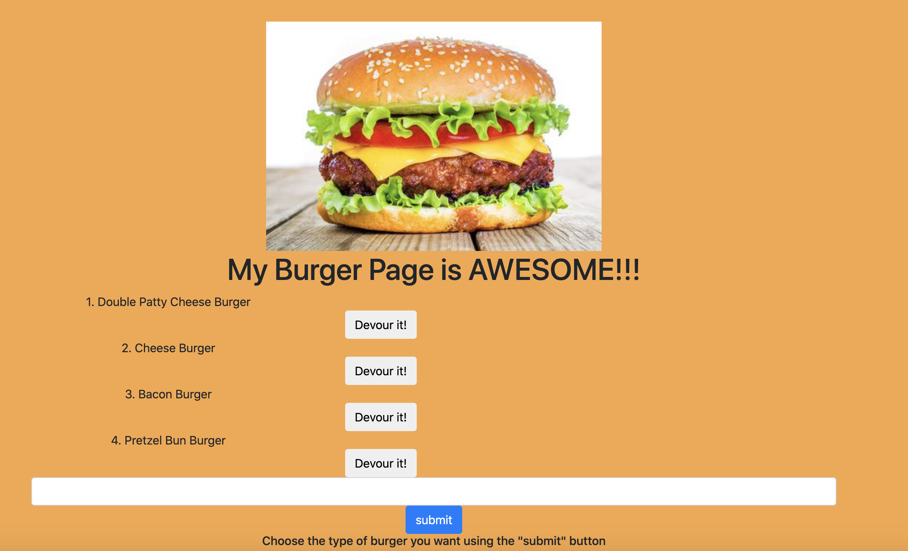

# burger

This application used MVC design pattern to create a burger logger with MySQL, Node, Express, Handlebars and a homemade ORM.

## How to run application
- npm i 
- establish connection to database

## Contributors 
- Caroline Ninganga

## Technologies Used
- Node Js
- Express
- MySql
- Handlebars

